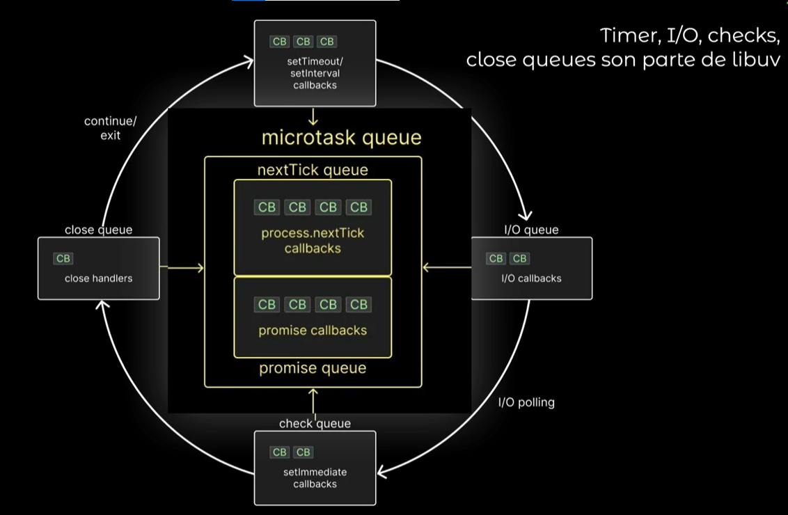

# Repaso de NodeJs - Guia personal

Node es un ambiente desligado del navegador para ejecutar javascript

caracteristicas principales
asincronia, npm, construcciones de servidores
 non-blocking i/o: casi ninguna funcion en node bloquea la lectura, por lo que podemos tener cientos de peticiones sin bloquear el servidor

I/O se refiere a la interaccion con el disco duro

NPX: node package execute

Pilas de ejecucion (CallStack):
Se ejecuta sincrono, si hay un callback se va a libuv (asincrono)
eventLoop se encarga de la cola de tareas
EventLoop:
CallBacks en microtask
CallBacks detro de timer
CallBack en el microtask queue(si hay) se ejecutan despues
CallBacks de I/O
